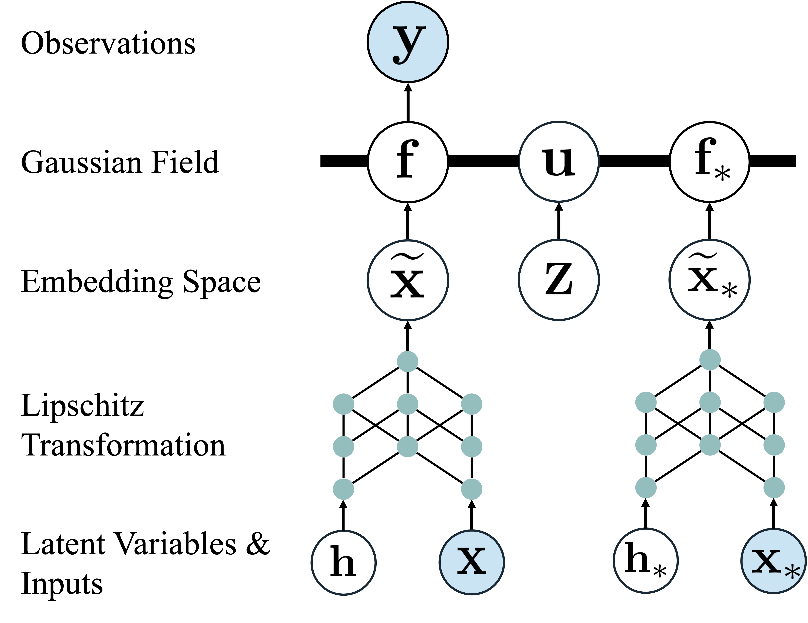
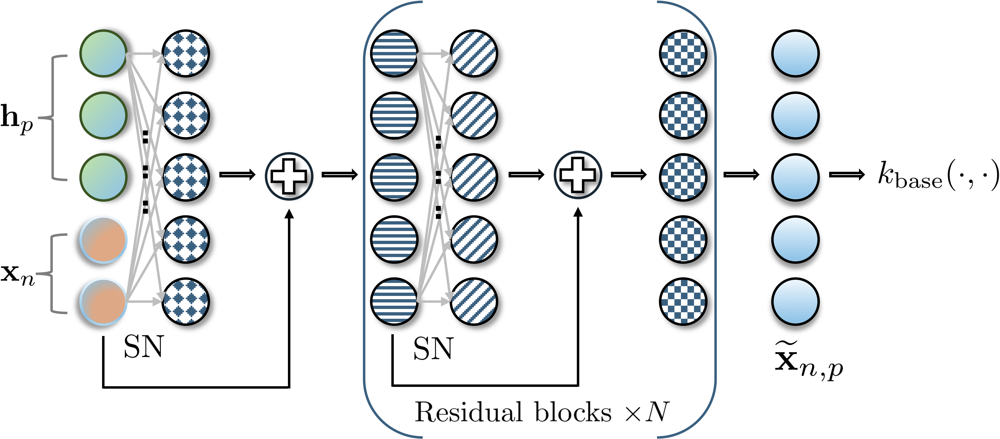

# Transformed Latent Variable Multi-Output Gaussian Processes (ICML 2026)
This repository contains the official PyTorch implementation for the ICML 2026 paper "Transformed Latent Variable Multi-Output Gaussian Processes". In this work, we propose a flexible multi-output deep
kernel by mapping inputs and output-specific latent variables into an embedding space using a Lipschitz-regularised neural network. Combined with stochastic variational inference, our model effectively scales to high-dimensional output settings.
<table>
  <tr>
    <td align="center" width="40%">
      <br>
    </td>
    <td align="center" width="60%">
      <br>
    </td>
  </tr>
</table>

## Environment Setup
The required packages are listed in environment.yml. Users can recreate the environment by running
```
conda env create -f environment.yml
```

## Code Structure
The core Python implementation of T-LVMOGP is provided in the `models/` directory. In particular, the `models/building_blocks/` subdirectory contains the fundamental Gaussian process and neural network components. The script `dkl_lvmogp_base.py` defines the base T-LVMOGP model, which is reused across different experimental settings, while experiment-specific files, such as `dkl_lvmogp_eeg.py`, implement variants tailored to particular datasets or tasks.

The implementations of the baseline models are provided in the `baselines/` directory, with experiment-specific baseline scripts organised under `experiments/`. Likelihood modules, including the Gaussian likelihood and the (zero-inflated) negative binomial likelihood, are implemented in `likelihood/`. Kernel functions are implemented in `kernels/`, and general utility functions used throughout the repository are collected in `utils/`.

## Baseline Implementations

Below is a reference list of (official) GitHub repositories that implement baseline MOGP models:
| Baseline Model | Reference |
| ----- | -----|
| SGPRN [(code)](https://github.com/shib0li/Scalable-GPRN/tree/main)  | Scalable Gaussian Process Regression Networks (IJCAI 2020) [(paper)](https://arxiv.org/abs/2003.11489) |
| OILMM [(code)](https://github.com/wesselb/oilmm) | Scalable Exact Inference in Multi-Output Gaussian Processes (ICML 2020) [(paper)](https://arxiv.org/abs/1911.06287) |
| G-MOGP [(code)](https://github.com/Blspdianna/GMOGP) | Graphical Multioutput Gaussian Process with Attention (ICLR 2024) [(paper)](https://openreview.net/forum?id=6N8TW504aa) |
| GS-LVMOGP [(code)](https://github.com/XiaoyuJiang17/GS-LVMOGP) | Scalable Multi-Output Gaussian Processes with Stochastic Variational Inference (TMLR 2025) [(paper)](https://arxiv.org/abs/2407.02476) |
